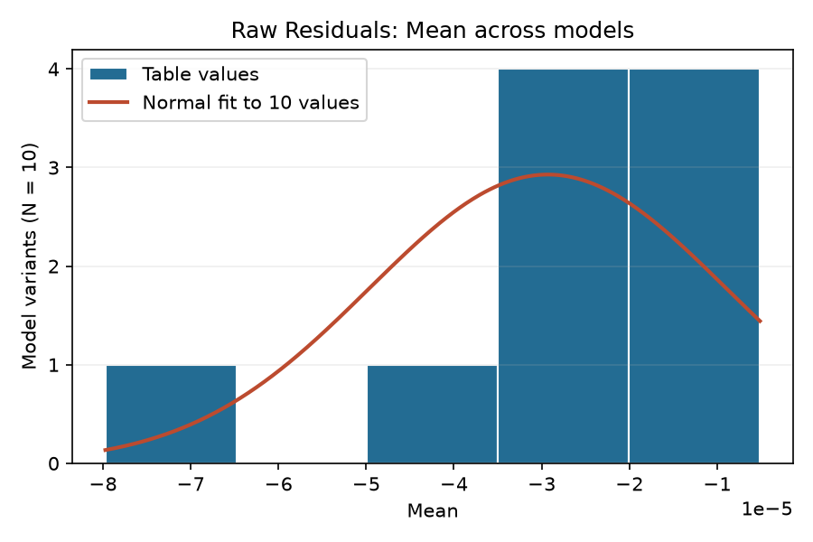
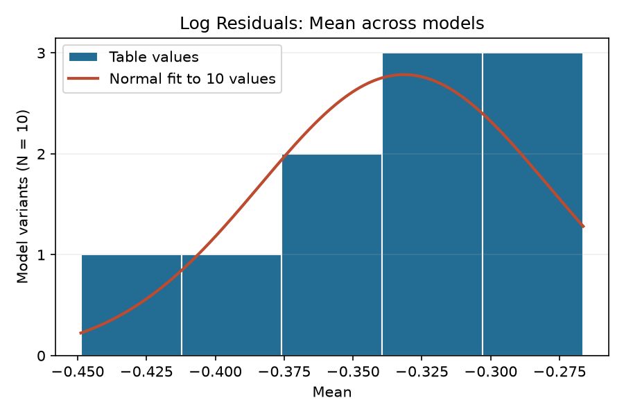
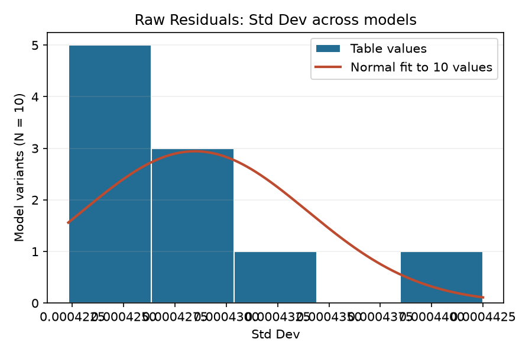
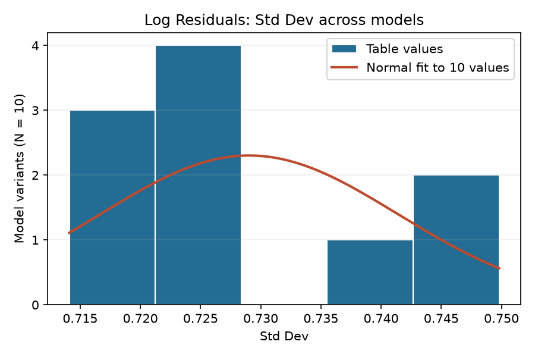
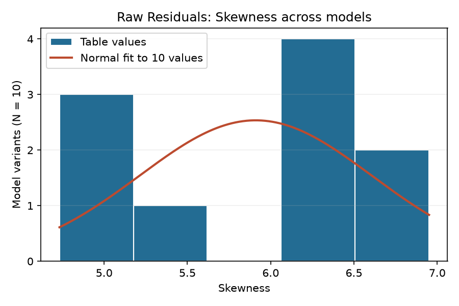
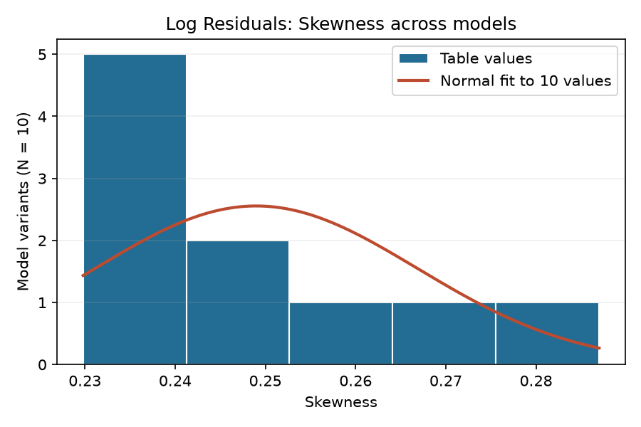
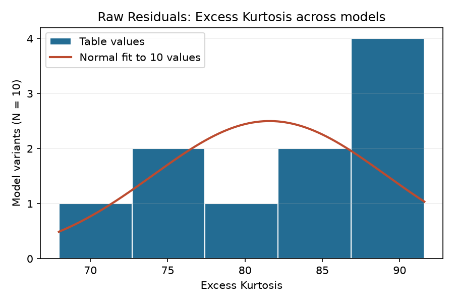
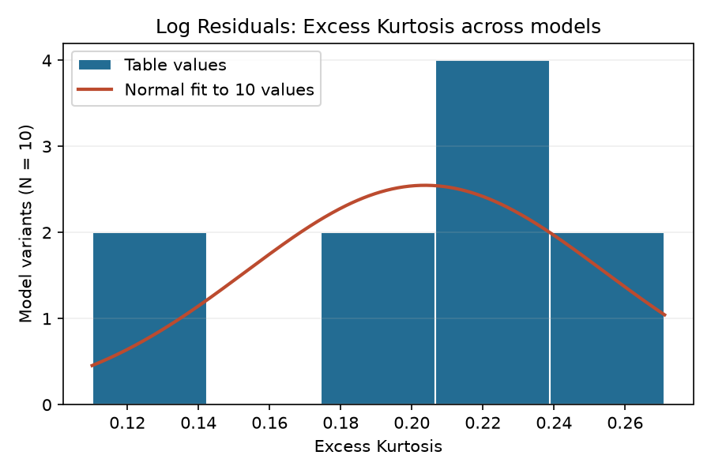
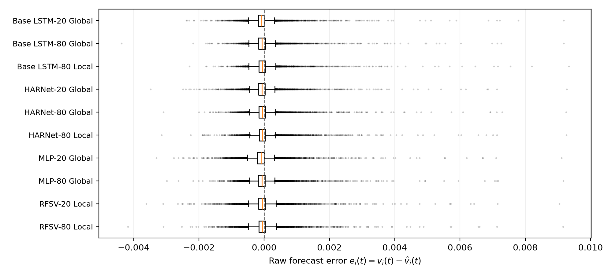

# Table 1: Individual Residual Histograms (N = 8,800 observations)

Four sample moments (mean, standard deviation, skewness, and excess kurtosis) for the ten retained model variants across all 8,800 test observations (1,760 trading dates across the five local assets NVDA, AAPL, NFLX, GOOG, and AMZN).

- **Raw Residuals**: $e_i(t) = v_i(t) - \widehat{v}_i(t)$ (daily unannualized adjusted GK variance)
- **Log Residuals**: $\ln v_i(t) - \ln \widehat{v}_i(t)$ (dimensionless)

| Model Variant | Plot / Transform | Mean | Std Dev | Skewness | Excess Kurtosis |
| :--- | :--- | :---: | :---: | :---: | :---: |
| Base LSTM-20 Global | Raw Residuals | -4.293 × 10⁻⁵ | 4.298 × 10⁻⁴ | +6.217 | +87.18 |
| Base LSTM-20 Global | Log Residuals | -0.3789 | 0.7141 | +0.2870 | +0.2424 |
| Base LSTM-80 Global | Raw Residuals | -1.970 × 10⁻⁵ | 4.257 × 10⁻⁴ | +6.317 | +84.83 |
| Base LSTM-80 Global | Log Residuals | -0.3454 | 0.7235 | +0.2425 | +0.2711 |
| Base LSTM-80 Local | Raw Residuals | -5.121 × 10⁻⁶ | 4.425 × 10⁻⁴ | +6.951 | +91.60 |
| Base LSTM-80 Local | Log Residuals | -0.3122 | 0.7410 | +0.2391 | +0.2311 |
| HARNet-20 Global | Raw Residuals | -3.377 × 10⁻⁵ | 4.293 × 10⁻⁴ | +5.594 | +78.27 |
| HARNet-20 Global | Log Residuals | -0.3387 | 0.7258 | +0.2509 | +0.1991 |
| HARNet-80 Global | Raw Residuals | -1.628 × 10⁻⁵ | 4.252 × 10⁻⁴ | +6.511 | +88.19 |
| HARNet-80 Global | Log Residuals | -0.3160 | 0.7280 | +0.2355 | +0.2152 |
| HARNet-80 Local | Raw Residuals | -6.461 × 10⁻⁶ | 4.256 × 10⁻⁴ | +6.297 | +84.53 |
| HARNet-80 Local | Log Residuals | -0.2895 | 0.7266 | +0.2342 | +0.1999 |
| MLP-20 Global | Raw Residuals | -7.972 × 10⁻⁵ | 4.321 × 10⁻⁴ | +5.074 | +72.93 |
| MLP-20 Global | Log Residuals | -0.4488 | 0.7147 | +0.2748 | +0.2272 |
| MLP-80 Global | Raw Residuals | -3.030 × 10⁻⁵ | 4.223 × 10⁻⁴ | +6.316 | +87.24 |
| MLP-80 Global | Log Residuals | -0.3514 | 0.7186 | +0.2571 | +0.2295 |
| RFSV-20 Local | Raw Residuals | -3.193 × 10⁻⁵ | 4.285 × 10⁻⁴ | +4.732 | +67.96 |
| RFSV-20 Local | Log Residuals | -0.2664 | 0.7498 | +0.2390 | +0.1116 |
| RFSV-80 Local | Raw Residuals | -2.679 × 10⁻⁵ | 4.237 × 10⁻⁴ | +5.091 | +73.15 |
| RFSV-80 Local | Log Residuals | -0.2679 | 0.7483 | +0.2298 | +0.1101 |

## Table 1 metric distributions across models

Each histogram contains the ten **displayed Table 1 values** for one metric and one residual transform. The vertical axis counts model variants, not individual residuals. Five equal-width bins summarize these ten values. The orange normal curve uses their mean and population standard deviation and is scaled to expected counts per bin. With only ten values, it is a descriptive reference, not a normality test or an outlier threshold.

| Metric | Raw residual plots | Log residual plots |
| :--- | :---: | :---: |
| Mean |  |  |
| Std Dev |  |  |
| Skewness |  |  |
| Excess Kurtosis |  |  |

## Raw Variance Forecast Error Boxplot

Comparative boxplots of raw one-step variance forecast errors ($e_i(t) = v_i(t) - \widehat{v}_i(t)$) for each of the ten retained model variants across all 8,800 test observations (1,760 trading dates across the five local assets NVDA, AAPL, NFLX, GOOG, and AMZN). The single panel shows the full residual range, including every flier. Boxes show the interquartile range; each whisker ends at the most extreme observation within $1.5 \times \text{IQR}$ of its box edge. Orange lines mark medians, and the dashed vertical line marks zero error.
